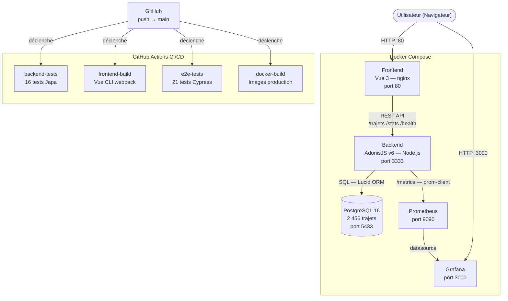

# ObRail Europe — MSPR TPRE532

Industrialisation d'une solution de visualisation des dessertes ferroviaires européennes.

**Équipe :** SHADKANI Monir · DULAC Alexis · MEKKI Mohamed Amine · Nathan · Justin

---

## Prérequis

- [Docker](https://docs.docker.com/get-docker/) + Docker Compose
- Ports libres : **80**, **3000**, **3333**, **5433**, **9090**

---

## Lancement

```bash
# Cloner le dépôt
git clone <url-du-repo>
cd MSPR3

# Démarrer tous les services
docker compose up -d
```

L'application est prête quand tous les conteneurs sont `Up` (`docker compose ps`).

---

## Accès aux interfaces

| Service | URL | Identifiants |
|---|---|---|
| **Frontend** (application) | http://localhost | `admin` / `motdepasse` (ou tout identifiant non vide) |
| **API REST** | http://localhost:3333 | — |
| **Documentation API** (Swagger) | http://localhost:3333/docs | — |
| **Santé de l'API** | http://localhost:3333/health | — |
| **Grafana** (monitoring) | http://localhost:3000 | `admin` / `admin` |
| **Prometheus** (métriques brutes) | http://localhost:9090 | — |

---

## Architecture



**Stack :**
- **Backend** : AdonisJS v6, TypeScript, Lucid ORM
- **Frontend** : Vue 3, Pinia, Vue Router, Chart.js
- **Base de données** : PostgreSQL 16 (2 456 trajets réels)
- **Monitoring** : Prometheus + Grafana (dashboard provisionné automatiquement)
- **CI/CD** : GitHub Actions
- **Conteneurisation** : Docker + Docker Compose

---

## Endpoints API

| Méthode | Route | Description |
|---|---|---|
| `GET` | `/health` | État de santé (API + base de données) |
| `GET` | `/trajets` | Liste paginée des trajets (filtres : `serviceType`, `search`, `limit`, `page`) |
| `GET` | `/trajets/:id` | Détail d'un trajet |
| `GET` | `/stats/volumes` | Statistiques globales (répartition jour/nuit, top opérateurs, moyennes) |
| `GET` | `/metrics` | Métriques Prometheus |
| `GET` | `/docs` | Documentation Swagger UI |
| `GET` | `/docs/swagger.json` | Spécification OpenAPI 3.0 |

---

## Tests

### Tests backend (Japa)

```bash
cd backend
npm install
npm test
```

16 tests couvrant les endpoints `/health`, `/trajets` et `/stats/volumes`.  
Nécessite une base PostgreSQL accessible (variables d'env dans `.env`).

### Tests E2E (Cypress)

```bash
cd frontend
npm install

# Interface graphique (recommandé pour voir les tests en direct)
npm run cypress:open

# Mode headless (CI)
npm run cypress:run
```

Les tests E2E nécessitent que le stack Docker soit lancé (`docker compose up -d`).

> **Note macOS 15 (Sequoia)** : si Cypress refuse de démarrer, ouvrir `npx cypress open`
> depuis le Terminal pour déclencher la validation de sécurité macOS, puis réessayer.

### CI/CD (GitHub Actions)

Le pipeline `.github/workflows/ci.yml` s'exécute automatiquement sur chaque `push` vers `main` :

1. **Backend** : typecheck TypeScript + 16 tests Japa (avec PostgreSQL en service)
2. **Frontend** : build Vue 3
3. **E2E** : démarrage du stack Docker + tests Cypress
4. **Docker** : build des images de production

---

## Monitoring

Le dashboard Grafana est provisionné automatiquement au démarrage.

**Métriques suivies :**
- Disponibilité de l'API (`up`)
- Uptime du processus Node.js
- Heap mémoire V8 (utilisé / total)
- Nombre de requêtes HTTP par route
- Latence des requêtes (p50 / p95)

Le dashboard est accessible à http://localhost:3000 (admin / admin) dans le dossier **ObRail API**.

---

## Variables d'environnement

Le fichier `docker-compose.yml` contient toutes les variables nécessaires.  
Pour un déploiement hors Docker, créer un fichier `.env` dans `backend/` :

```env
APP_KEY=paKXSmXmVKDmjnIjECmHCZMmWOBpkSzN
DB_HOST=localhost
DB_PORT=5432
DB_USER=postgres
DB_PASSWORD=postgres
DB_DATABASE=obrail_db
PORT=3333
NODE_ENV=production
```

---

## Arrêt et nettoyage

```bash
# Arrêter les services (données conservées)
docker compose down

# Arrêter et supprimer les volumes (reset complet)
docker compose down -v
```

---

## Conformité

- **RGPD** : aucune donnée personnelle traitée. Les données ferroviaires sont issues de sources open data publiques (GTFS européens).
- **RGAA** : lien d'évitement, rôles ARIA (`role="main"`, `role="navigation"`), attributs `aria-label`, `aria-live`, `aria-busy`, `scope="col"` sur les en-têtes de tableau, focus visible (`:focus-visible`).
- **Sécurité** : validation des paramètres côté backend (AdonisJS VineJS), gestion normalisée des erreurs HTTP, pas de données sensibles exposées.
